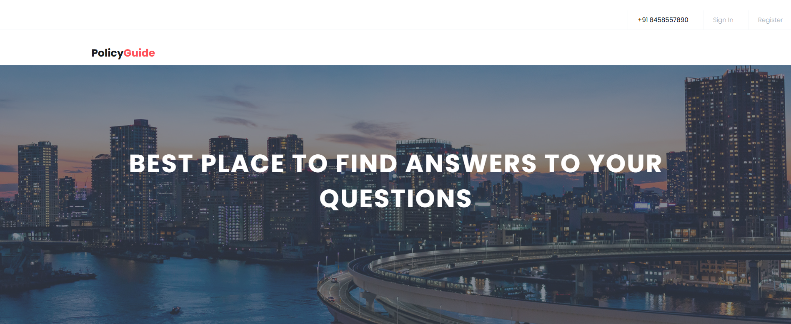
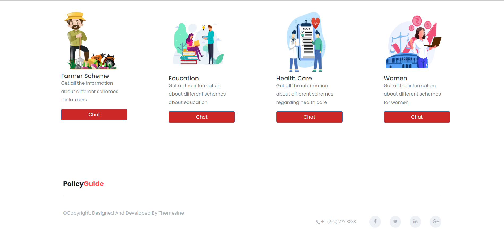
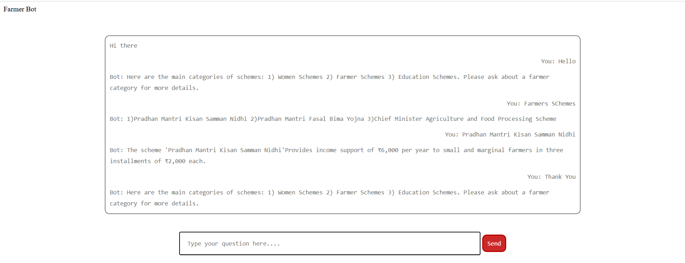

# PolicyGuide 🗺️ – Chatbot for Government Schemes

**PolicyGuide** is an intelligent chatbot designed to help users navigate Indian Government Schemes related to **Farmers**, **Education**, **Healthcare**, and **Women Empowerment**. It uses Natural Language Processing (NLP) and Machine Learning to understand user queries and respond with accurate information collected from verified government sources.

## 🔍 Features

- Multi-domain chatbot interface:
  - 🧑‍🌾 Farmer
  - 🎓 Education
  - 🏥 Healthcare
  - 👩 Women Welfare
- Data collected from authentic government websites and structured into `.json` files
- Trained using **Logistic Regression** and **TF-IDF vectorization**
- Django-based web frontend for category-wise interactions
- Modular architecture with separate models for each category

## 📁 Project Structure
PolicyGuide/
│
├── chatbot/
│ ├── chatbot.py # Core chatbot logic (NLP + ML)
│ ├── views.py # Django views for each scheme category
│ ├── farmerbot.py # Farmer chatbot logic
│ ├── educationbot.py # Education chatbot logic
│ ├── womenbot.py # Women chatbot logic
│ ├── healthbot.py # Healthcare chatbot logic
│ ├── intents.json # General training data (questions & responses)
│ ├── farmer.json # Farmer scheme data
│ ├── education.json # Education scheme data
│ ├── women.json # Women scheme data
│ └── health.json # Healthcare scheme data
│
├── templates/
│ ├── farmer.html
│ ├── education.html
│ ├── women.html
│ └── health.html
│
├── static/
│ └── images/
│ ├── Home.png # Landing page UI
│ ├── Home1.png # Alternate home design
│ └── demo.png # Sample interaction with the chatbot
│
└── manage.py # Django entry point


## 🧠 Technologies Used

- **Python 3**
- **Django**
- **NLTK** – for tokenization, stopword removal, and lemmatization
- **Scikit-learn** – for TF-IDF Vectorization and Logistic Regression
- **HTML/CSS/JavaScript** – for the web frontend

## 🛠 How It Works

1. **Training**:
   - Each domain (farmer, education, women, health) has its own `.json` file containing questions and responses.
   - Text is cleaned, tokenized, lemmatized, and vectorized using TF-IDF.
   - A Logistic Regression model is trained per domain.

2. **User Interaction**:
   - User types a question in the web interface.
   - Django view receives the message and routes it to the corresponding domain model.
   - Chatbot processes input and returns a suitable response.

## 🚀 Running the Project

```bash
# Set up virtual environment
python3 -m venv venv
source venv/bin/activate

# Install dependencies
pip install -r requirements.txt

# Run the Django server
python manage.py runserver

Then open your browser and go to: http://127.0.0.1:8000/

## 📸 Screenshots

### 🏠 Home Page  


### 🏠 Alternate Home Page  


### 🤖 Chatbot Interaction (Farmer Example)  


